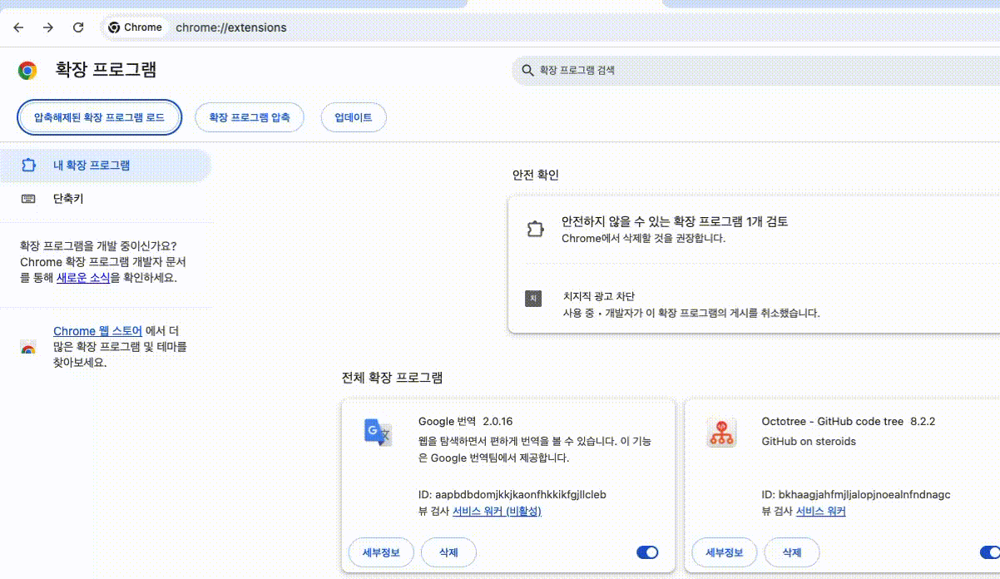

<div align="center">
  
  <h1>ZOOPS-TENSION</h1>
  <p><strong>ZOOPZOOP 웹 서비스에서 제공하는 웹페이지 스크랩 크롬 확장 프로그램</strong></p>
  <p>원하는 웹페이지의 콘텐츠를 손쉽게 스크랩하고 관리하세요.</p>
</div>

---

## ✨ 주요 기능

- **원클릭 스크랩**: 버튼 클릭 한 번으로 현재 보고 있는 페이지의 콘텐츠를 스크랩합니다.
- **소셜 로그인**: 구글, 카카오 계정을 통해 간편하게 로그인할 수 있습니다.
- **스크랩 관리**: 스크랩한 데이터는 ZOOPZOOP 서비스에서 편리하게 확인하고 관리할 수 있습니다.

---

## 🚀 설치 가이드

ZOOPS-TENSION은 현재 크롬 웹 스토어에 등록되어 있지 않습니다. 아래의 수동 설치 가이드를 따라주세요.

1.  **확장 프로그램 다운로드**

    - 아래 링크에서 `dist` 폴더를 다운로드하세요.
    - **[ZOOPS-TENSION v1.0.0 다운로드](https://github.com/prgrms-web-devcourse-final-project/WEB5_6_ZOOPS_TENSION_FE/releases/download/chrome-extension/dist.zip)**

2.  **압축 해제**

    - 다운로드한 파일의 압축을 해제합니다.

3.  **크롬 확장 프로그램 페이지 열기**

    - 크롬 브라우저를 열고 주소창에 `chrome://extensions`를 입력하여 확장 프로그램 관리 페이지로 이동합니다.

4.  **개발자 모드 활성화**

    - 페이지 우측 상단의 **'개발자 모드(Developer mode)'** 토글을 활성화해주세요.

5.  **확장 프로그램 로드**
    - **'압축 해제된 확장 프로그램을 로드합니다(Load unpacked)'** 버튼을 클릭합니다.
    - 파일 탐색기가 열리면, 아까 압축을 해제했던 **`dist`** 폴더를 선택하고 확인을 누릅니다.
      
6.  **설치 완료**
    - 이제 ZOOPS-TENSION 확장 프로그램이 설치되어 브라우저 툴바에서 아이콘을 확인할 수 있습니다.
7.  **사용 방법**
    

---

## 🛠️ 개발자를 위한 안내

### 시작하기

프로젝트를 로컬 환경에서 실행하려면 다음 단계를 따르세요.

1.  **저장소 복제**

    ```bash
    git clone https://github.com/your-repository-url.git
    cd WEB5_6_ZOOPS_TENSION_FE
    ```

2.  **의존성 설치**

    ```bash
    npm install
    ```

3.  **개발 서버 실행**
    ```bash
    npm run dev
    ```
    > `vite` 개발 서버가 실행됩니다. 변경사항은 HMR(Hot Module Replacement)을 통해 자동으로 반영됩니다.

### 빌드

프로덕션용으로 확장 프로그램을 빌드하려면 다음 명령어를 사용하세요.

```bash
npm run build
```

빌드가 완료되면 `dist` 폴더에 압축되지 않은 확장 프로그램 파일이 생성됩니다. 이 폴더를 사용하여 위 `설치 가이드`에 따라 크롬에 설치할 수 있습니다.

---

## 💻 기술 스택

- **Core**: `React`, `TypeScript`
- **Build**: `Vite`
- **Styling**: `Tailwind CSS`
- **State Management**: `React Hooks`
- **Linting**: `ESLint`
